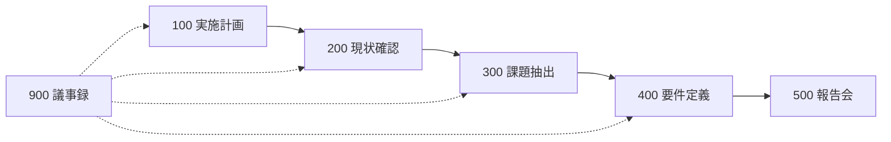

# Program Phases: Investigation to Requirements

**Version:** v1.0  
**Status:** Active  
**Owner:** Kazuaki Tanaka  
**Origin:** 公共セクター大規模OA刷新案件の納品物構成（2009年頃）を一般化

---

## Purpose

調査研究から要件定義までを段階的に進める**大規模IT刷新プログラム**のフェーズ設計です。

単発の提案書やSteerComm資料ではなく、**数ヶ月〜年単位のプログラム全体**の成果物順序とゲートを定義します。

---

## When to Use

- 省庁・公共機関向けOA/基盤刷新
- As-Is調査 → 課題抽出 → 方式検討 → 要件定義 の一連プログラム
- PgMO/PMOによる成果物管理（`frameworks/transformation-pmo.md` 参照）
- 中間報告会・最終報告会の設計

---

## Phase Overview

| Phase | 名称 | 主目的 | 典型ゲート |
|-------|------|--------|-----------|
| **100** | 実施計画 | プログラム憲章・スコープ・体制合意 | キックオフ・計画承認 |
| **200** | 現状確認 | As-Isの客観的把握 | 調査完了 |
| **300** | 課題抽出・改善案 | Gap特定・改善方向・換装時期 | 課題合意 |
| **400** | 要件定義 | 方式決定・要件書化 | 要件FIX |
| **500** | 調査研究報告会 | 中間/最終報告・ステークホルダー合意 | 報告会承認 |
| **900** | 会議議事録 | 全フェーズ横断の決定・ToDo管理 | （継続） |

---

## Phase 100: 実施計画

### 目的

プログラムの**存在理由・スコープ・体制・進め方**を合意する。

### 典型成果物

| 成果物 | 内容 |
|--------|------|
| プロジェクト憲章 / 実施計画書 | 目的、スコープ、体制、マイルストーン |
| 官側要求事項 / ステークホルダー要求 | 発注側・利用側の要求の整理 |
| 実施計画概要 | フェーズ・会議体・報告ライン |

### 完了条件

- [ ] スポンサー・PM・主要ステークホルダーの合意
- [ ] 100→500の成果物一覧と日程
- [ ] 会議体（定例・進捗会議）の定義

---

## Phase 200: 現状確認

### 目的

**As-Is**をデータ・ヒアリング・現地調査で客観的に把握する。  
ここで「課題」を決めない — 事実を集める。

### 典型成果物

| 成果物 | 内容 |
|--------|------|
| 調査方針 | 対象、方法、日程 |
| アンケート / ヒアリング | 一般ユーザー向け、システム担当者向け |
| 現地調査 | 拠点・運用実態 |
| システム資産・コスト分析 | 現行構成、ライセンス、運用負荷 |
| インシデント分析 | 障害・問合せ傾向 |

### 完了条件

- [ ] As-Isの主要ファクトが文書化されている
- [ ] 200の結果が300の入力になっている（ギャップ分析の材料）

---

## Phase 300: 課題抽出・改善案

### 目的

As-Isから**構造的なGap**を抽出し、改善方向と**換装・移行の時期判断**まで進める。

### 典型成果物

| 成果物 | 内容 |
|--------|------|
| 問題抽出表 | 現象・原因・影響・優先度 |
| 課題・改善案のまとめ | Gap → 改善案の対応 |
| 換装時期検討 | 時期判断の進め方、ワークシート |

### 思考の型

`pattern-02`（As-Is → Gap → To-Be）を適用。  
Gapは「不満リスト」ではなく、As-Isと目指す方向の**構造的差分**として書く。

### 完了条件

- [ ] 主要課題がステークホルダーと合意
- [ ] 改善案の方向性（方式の選択肢）が400の入力になっている
- [ ] 換装時期の判断材料が揃っている

---

## Phase 400: 要件定義

### 目的

方式を**比較・評価・選定**し、**要件定義書**としてFIXする。

### サブフェーズ

| サブ | 名称 | 内容 |
|------|------|------|
| **410** | 方式検討 | 複数案（例：ゾーニング方式）、各案評価シート |
| **420** | 要件定義書 | 機能・非機能・移行・運用・テスト要件 |

### 410: 方式検討の典型流れ

1. 現行方式の整理（As-Is）
2. 次期方式の選択肢（2–4案）
3. **各案評価シート**（評価軸 × 案）
4. 推奨案と根拠
5. 関連詳細（メール/ウェブの流れ、ネットワーク構成 等）

### 420: 要件定義書の章立て（参考）

| 章 | 内容 |
|----|------|
| 1. 基本事項 | 目的、対象、前提条件 |
| 2. システム体系 | 全体構成、ゾーニング、機能別要件 |
| 3–5. 非機能 | 規模・性能、信頼性、拡張性 |
| 6–7. 安全・環境 | セキュリティ、対災害、環境 |
| 8–9. テスト・移行 | 受入テスト、移行・教育 |
| 10. 運用 | 運用・保守時間、サービス定義 |

別添：SLA、業務プロセスマップ、連携ポイント一覧 等。

### 完了条件

- [ ] 方式が選定され、根拠が記録されている
- [ ] 要件定義書がレビュー・承認されている
- [ ] 500報告会で説明可能な状態

---

## Phase 500: 調査研究報告会

### 目的

プログラム成果を**ステークホルダーに報告**し、次フェーズ（設計・調達等）への合意を得る。

### 典型成果物

| 成果物 | 内容 |
|--------|------|
| 調査研究報告書 | 100–400の要約・結論 |
| 報告会資料 | エグゼクティブ向けストーリー |

### ストーリー構成（推奨）

1. 背景・目的（100）
2. 現状の要点（200）
3. 主要課題と改善方向（300）
4. 推奨方式と要件の概要（400）
5. 次ステップ・依頼事項

---

## Phase 900: 会議議事録

全フェーズ横断。命名例：`YYYYMMDD_会議種別_回次`

- 決定事項
- ToDo（担当・期限）
- 次回予定

**900は成果物の「索引」ではなく、合意と実行の記録。**

---

## Gate Rules（フェーズ間）

| 遷移 | 必須条件 |
|------|---------|
| 100 → 200 | 計画承認、調査範囲確定 |
| 200 → 300 | As-Isファクトの主要項目完了 |
| 300 → 400 | 課題合意、方式検討の入力Ready |
| 400 → 500 | 要件FIXまたは報告会版FIX |
| 500 → 次プログラム | 報告会承認、RFP/設計への引継ぎ |

**How（詳細設計・調達）に進む前に、What（方式・要件）がFIXしていること。**  
`core/author-voice.md` の「定義が先、Howは後」と同型。

---

## Relationship to Thinking Patterns

| フェーズ | パターン |
|---------|---------|
| 200 | As-Is（Fact収集） |
| 300 | As-Is → Gap → To-Be（改善方向） |
| 410 | 複数案比較 + 評価シート |
| 420 | Strategy → Org → Process → System（`pattern-06`） |
| 500 | Why → What → 次のHow（`pattern-01`） |

---

## Anti-Patterns

| 避ける | 理由 |
|--------|------|
| 200を飛ばして300 | Gapに根拠がない |
| 410を飛ばして420 | 方式未決定で要件がブレる |
| 500だけ豪華で中身薄 | 報告会資料だけ作って本体が未完了 |
| 900なし | 決定・ToDoが失われる |

---

## Related Assets

| ファイル | 関係 |
|---------|------|
| `frameworks/thinking-patterns/pattern-02-as-is-gap-to-be.md` | 300の思考 |
| `frameworks/thinking-patterns/pattern-01-why-what-how.md` | 500のストーリー |
| `standards/vendor-proposal-evaluation.md` | 400以降のRFP・選定 |
| `core/author-voice.md` | 資料のトーン・削減 |
| `knowledge/lessons/author-voice-archetypes-legacy.md` | 各成果物のアーキタイプ |

---

## Completion Checklist（プログラム設計時）

- [ ] 100–500の成果物一覧が定義されているか
- [ ] 各フェーズのゲート条件が明確か
- [ ] 900（議事録）の命名・保管ルールがあるか
- [ ] 400で方式→要件の順序が守られているか
- [ ] 500報告が100–400の要約になっているか（独立ストーリーになっていないか）
